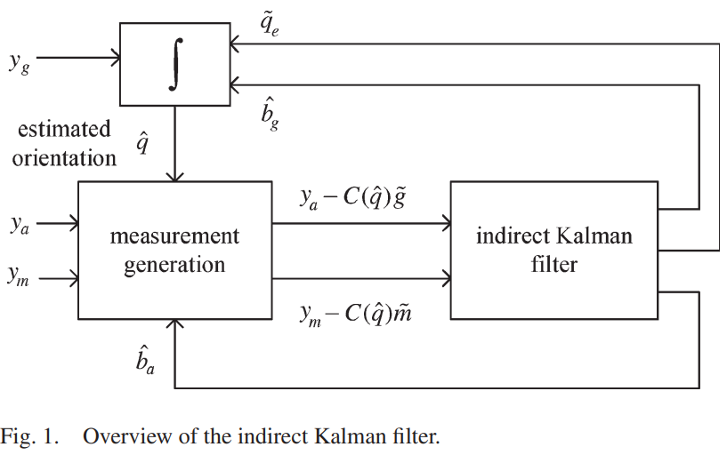

# Indirect-Kalman-Filter-IKF-for-attitude-estimation
This repository contains the Matlab code implementation of the research paper entitled: Orientation Estimation Using a Quaternion-Based Indirect Kalman Filter With Adaptive Estimation of External Acceleration and published by [Young Soo Suh](https://scholar.google.co.kr/citations?user=Zta7ztAAAAAJ&hl=en)

## Abstract 
This paper is concerned with orientation estimation
using inertial and magnetic sensors. A quaternion-based indirect
Kalman filter structure is used. The magnetic sensor output is
only used for yaw angle estimation using two-step measurement
updates. External acceleration is estimated from the residual of
the filter and compensated by increasing the measurement noise
covariance. Using the direction information of external information, the proposed method prevents unnecessarily increasing the
measurement noise covariance corresponding to the accelerometer
output, which is not affected by external acceleration. Through
numerical examples, the proposed method is verified.

you can find this paper here: https://ieeexplore.ieee.org/document/5462839

## Overview of the indirect Kalman filter

## Estimated Pitch, Roll and Yaw against real Pitch, Roll and Yaw

